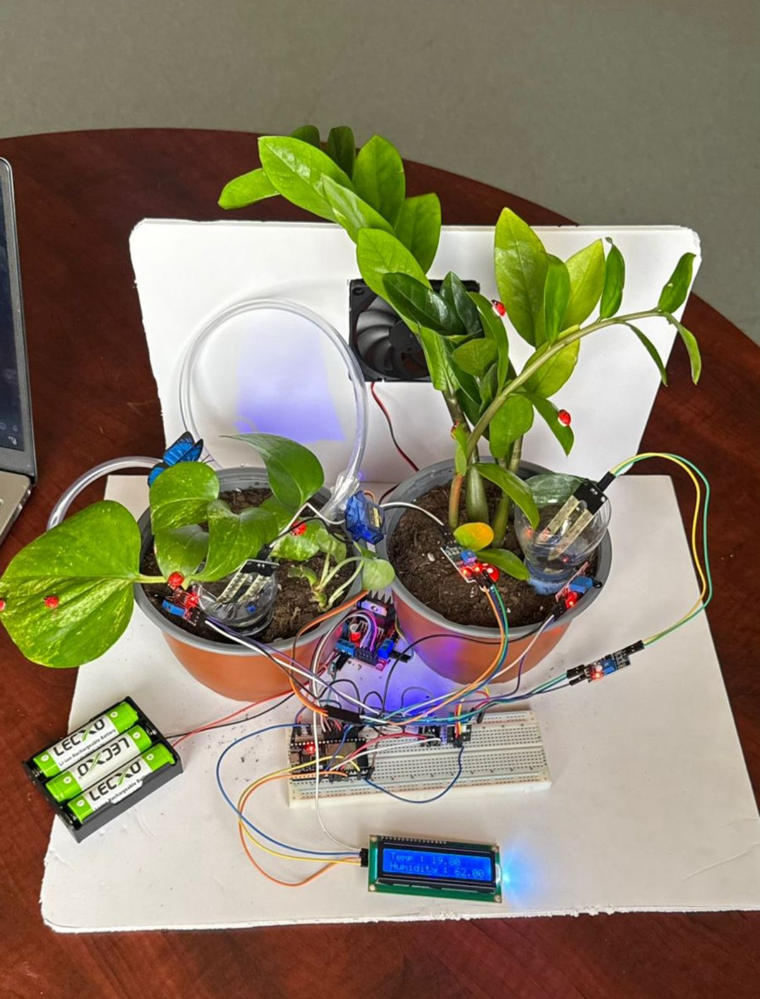
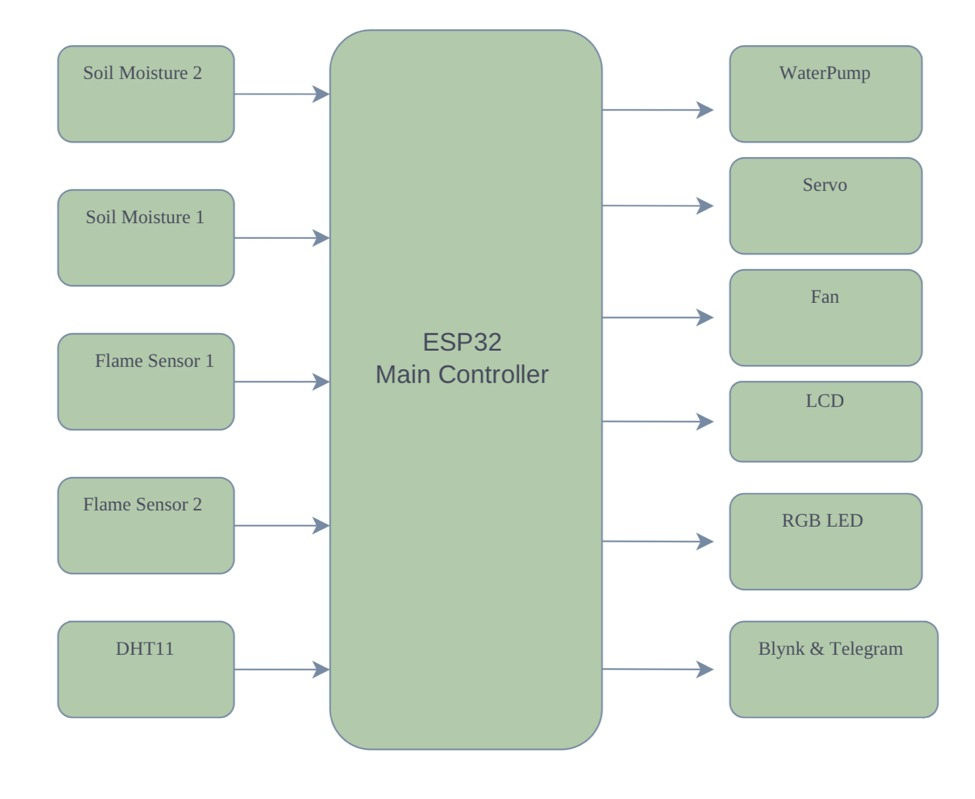
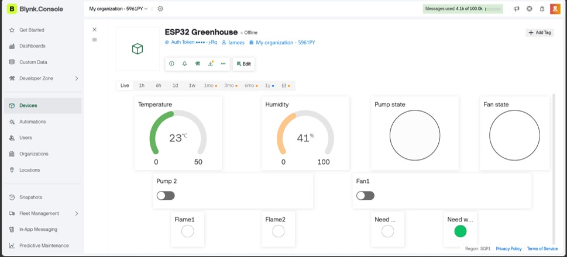

# Smart-Greenhouse-System
# 🌱 Smart Greenhouse System

An IoT-based Smart Greenhouse developed using **ESP32** to automate plant care through environmental monitoring, automatic irrigation, and remote control.

---

## 📖 Overview

This project was developed as part of our **Real-Time Embedded Systems & Microcontrollers** course.

The system monitors environmental conditions and automatically responds by controlling irrigation, cooling, and safety features. Users can also monitor the greenhouse remotely using the Blynk IoT platform and receive Telegram notifications.

---

## ✨ Features

- 🌡️ Temperature & Humidity Monitoring
- 💧 Automatic Irrigation using Soil Moisture Sensors
- 🌬️ Automatic Cooling Fan
- 🔥 Fire Detection
- 📱 Remote Monitoring using Blynk
- 🤖 Telegram Notifications
- 📟 LCD Display

---

## 🛠 Hardware Components

- ESP32
- DHT11 Sensor
- Soil Moisture Sensors
- Flame Sensors
- Servo Motor
- Water Pump
- DC Fan
- LCD Display
- RGB LED
- L298N Motor Driver

---

## 💻 Software

- Arduino IDE
- ESP32 Libraries
- Blynk IoT
- Telegram Bot API

---

## 🏗 System Architecture

---

## 🔌 Circuit Diagram

---

## 📱 Blynk Dashboard

---

## 👩‍💻 My Contributions

- Embedded Software Development
- ESP32 Programming
- Hardware Integration
- Circuit Assembly
- Prototype Development
- System Testing

---

## 👥 Team

This project was developed collaboratively as a university team project.

---

## 🚀 Future Improvements

- Weather API Integration
- AI-based Irrigation Prediction
- Solar Power Integration
- Water Tank Level Monitoring

---

Thank you for visiting this repository ⭐
